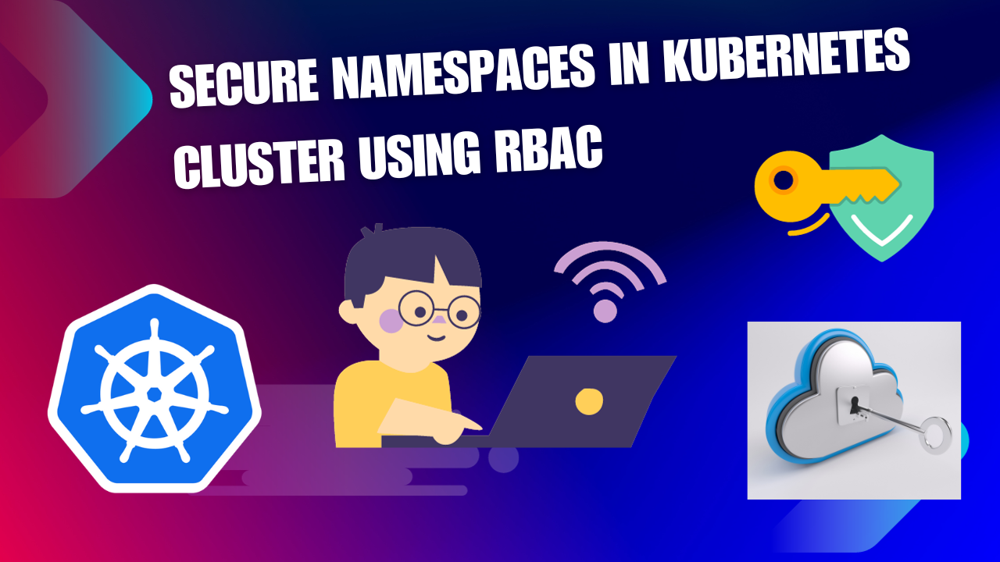
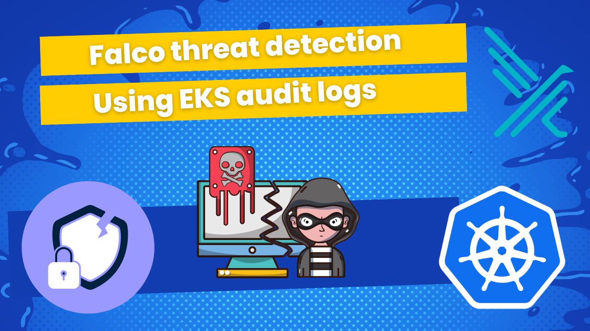

# A series of tutorials about Kubernetes security

### 1. [Secure namespaces in Kubernetes cluster using RBAC](secure-ns-k8s-rbac.md)
In this tutorial, I will show how to secure ‘system‘ namespaces in EKS cluster by user access.

> "List of namespaces with limited access: [kube-system, monitoring]

### 2. [Threat detection with Falco and EKS Audit Logs](falco-k8s-audit-logs.md)
In this tutorial, I will show how to:

* Install Falco to your EKS cluster using helm chart
* Enable EKS audit logs for your cluster
* Detect security events based on EKS audit logs activity.
* Overview of most useful rules for my opinion
