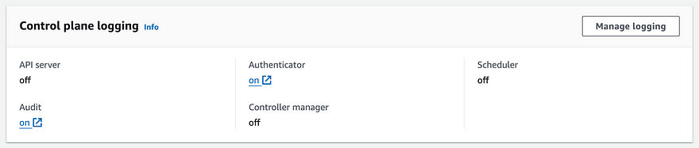
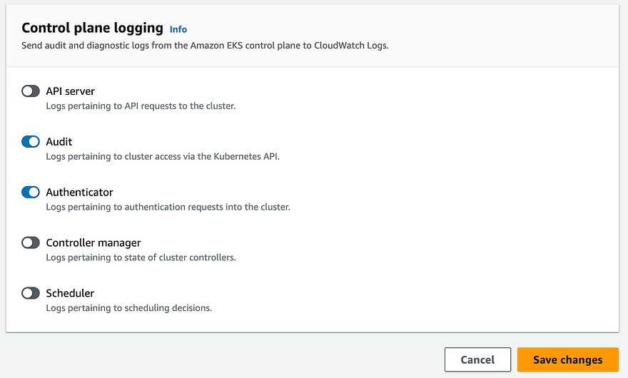
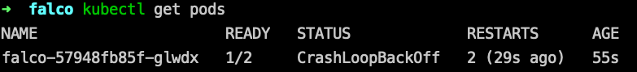
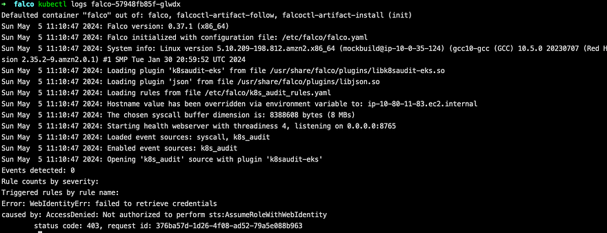
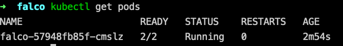
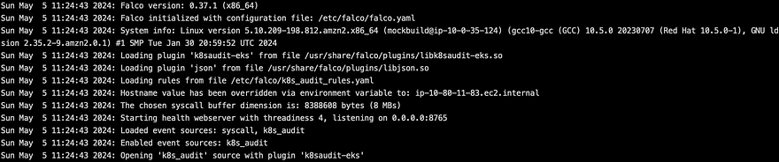

## Threat detection with Falco and EKS Audit Logs


In this tutorial, I will show how to:

* Install Falco to your EKS cluster using helm chart
* Enable EKS audit logs for your cluster
* Detect security events based on EKS audit logs activity.
* Overview of most useful rules for my opinion

> You can find list of all rules here https://github.com/falcosecurity/plugins/blob/main/plugins/k8saudit/rules/k8s_audit_rules.yaml

* How to add custom rules
* Example of how to trigger specific rule

### What is Falco?
> Falco is a cloud-native security tool designed for Linux systems. It employs custom rules on kernel events, which are enriched with container and Kubernetes metadata, to provide real-time alerts. Falco helps you gain visibility into abnormal behavior, potential security threats, and compliance violations, contributing to comprehensive runtime security.
https://falco.org/

### Prerequisites
* Existing EKS cluster

> You can find how to provision EKS cluster using terraform here: https://github.com/warolv/k8s-guides/blob/master/k8s-eks-with-terraform.md

## Enable EKS audit logs for your cluster

In AWS console -> Elastic Kubernetes Cluster -> choose you cluster -> Observability tab -> Manage logging



In Manage logging, enable 'Audit' and click 'Save changes'



## Create IAM role and policy for Falco

On EKS, the audit logs are sent to cloud watch logs, in order for Falco to pull those events we need read access for cloud watch logs:

This policy must be attached to role you creating: 'falco-k8s-role' for example

```json
{
  "Version":"2012-10-17",
  "Statement":[
    {
      "Sid":"ReadAccessToCloudWatchLogs",
      "Effect":"Allow",
      "Action":[
        "logs:Describe*",
        "logs:FilterLogEvents",
        "logs:Get*",
        "logs:List*"
      ],
      "Resource":[
        "arn:aws:logs:${REGION}:${ACCOUNT_ID}:log-group:/aws/eks/${CLUSTER_NAME}/cluster:*"
      ]
    }
  ]
}
```

falco-k8s-role' IAM role will be used with IRSA (IAM Roles for service accounts) in Falco

> https://docs.aws.amazon.com/eks/latest/userguide/iam-roles-for-service-accounts.html

To make it work with IRSA need to define 'Trust relationship' for this role

```json
{
    "Version": "2012-10-17",
    "Statement": [
        {
            "Effect": "Allow",
            "Principal": {
                "Federated": "arn:aws:iam::${ACCOUNT_ID}:oidc-provider/oidc.eks.${REGION}.amazonaws.com/id/${OIDC_PROVIDER_ID}"
            },
            "Action": "sts:AssumeRoleWithWebIdentity",
            "Condition": {
                "StringLike": {
                    "oidc.eks.${REGION}.amazonaws.com/id/${OIDC_PROVIDER_ID}:sub": "system:serviceaccount:falco:falco"
                }
            }
        }
    ]
}
```

* REGION: Region of your EKS cluster
* ACCOUNT_ID: The account ID of EKS cluster
* CLUSTER_NAME: EKS cluster name
* OIDC_PROVIDER_ID: OIDC Provider ID, to find it: go to IAM -> Identity Providers, you need to enable if not for IRSA to work.

## Install Falco to your EKS cluster using helm chart

values.yaml

```yaml
falco:
  rules_file:
    - /etc/falco/k8s_audit_rules.yaml
    - /etc/falco/rules.d
  plugins:
    - name: k8saudit-eks
      library_path: libk8saudit-eks.so
      init_config:
        shift: 10
        polling_interval: 10
        use_async: false
        buffer_size: 500
      open_params: ${CLUSTER_NAME}
    - name: json
      library_path: libjson.so
      init_config: ""
  # Plugins that Falco will load. Note: the same plugins are installed by the falcoctl-artifact-install init container.
  load_plugins: [k8saudit-eks, json]

falcosidekick:
  enabled: false

# -- Disable the drivers since we want to deploy only the k8saudit plugin.
driver:
  enabled: false

# -- Disable the collectors, no syscall events to enrich with metadata.
collectors:
  enabled: false

# -- Deploy Falco as a deployment. One instance of Falco is enough. Anyway the number of replicas is configurable.
controller:
  kind: deployment
  deployment:
    # -- Number of replicas when installing Falco using a deployment. Change it if you really know what you are doing.
    # For more info check the section on Plugins in the README.md file.
    replicas: 1

falcoctl:
  indexes:
  - name: falcosecurity
    url: https://falcosecurity.github.io/falcoctl/index.yaml
  artifact:
    install:
      # -- Enable the init container. We do not recommend installing (or following) plugins for security reasons since they are executable objects.
      enabled: true
    follow:
      enabled: true
  config:
    artifact:
      allowedTypes:
        - plugin
        - rulesfile
      install:
        enabled: false
        resolveDeps: false
        refs: [k8saudit-rules:0, k8saudit-eks:0, json:0]
      follow:
        refs: [k8saudit-rules:0]

serviceAccount:
  create: true
  annotations:
    eks.amazonaws.com/role-arn: {ROLE_ARN}
```

* CLUSTER_NAME: must be replaced with you EKS cluster name
* ROLE_ARN: IAM role arn for 'falco-k8s-role'

> We using deployment with 1 replica only to not duplicate alerts.
https://artifacthub.io/packages/helm/falcosecurity/falco
https://falco.org/blog/k8saudit-eks-plugin/

If you have taints defined for your k8s worker nodes, add tolerations section to your values.yaml, for example to run Falco on 'on-demand-large-node' nodes:

```yaml
tolerations:
- effect: NoSchedule
  key: on-demand-large-node
  operator: Exists
```

> https://kubernetes.io/docs/concepts/scheduling-eviction/taint-and-toleration/

## Installation of Falco helm chart

```bash
# Add falcosecurity repo
helm repo add falcosecurity https://falcosecurity.github.io/charts
helm repo update

# Install falco from values.yaml to falco namespace
helm install falco falcosecurity/falco --namespace falco \
--create-namespace -f values.yaml
```

hmm, I see Falco pod in  'CrashLoopBackOff' state:



Checking the logs I see 'AccessDenied: Not authorized to perform sts:AssumeRoleWithWebIdentity' message:



Meaning I need to validate IAM role created properly.

**Need to validate**:
* The name of the role is correct, same as you defined in values.yaml under service account annotations:

```yaml
serviceAccount:
  create: true
  annotations:
    eks.amazonaws.com/role-arn: {ROLE_ARN}
```

* In AWS Console -> IAM -> Role name -> Under Trust relationship tab, validate condition:

```json
"Condition": {
    "StringLike": {
        "oidc.eks.${REGION}.amazonaws.com/id/${OIDC_PROVIDER_ID}:sub": "system:serviceaccount:falco:falco"
    }
}
```

The 'system:serviceaccount:falco:falco', meaning you must have 'falco' service account in falco namespace, if you installed it to other namespace you will see this error, please change namespace accordingly!

**In case of successful Install you will see output like this**:






**Last two rows is important**:

* Enabled event sources: k8s_audit
* Opening 'k8s_audit' source with plugin 'k8saudit-eks'

You can 'kubectl exec' the pod and see default set of rules is downloaded and used with k8s audit plugin, it's k8s_audit_rules.yaml:


**To see all triggered alerts by Falco run**:

```bash
kubectl logs falco-57948fb85f-cmslz
```

## Overview of most useful rules for my opinion

The default set of rules for EKS audit logs plugin is heavy and added too much noise for me!

For example:
* Error K8s Secret Get Successfully (user=system:serviceaccount:operators:external-secrets …

I am using external secrets to sync secrets for k8s with AWS secrets manager, which is ok by me.

I saw more than 200 alerts of this type, after installation of Falco, meaning you need to do a lot of tuning after installation.

> You can find full list of alerts here:
https://github.com/falcosecurity/plugins/blob/main/plugins/k8saudit/rules/k8s_audit_rules.yaml

### List of alerts that created a lot of noise for me, especially the last one:
* K8s Deployment Created
* K8s Deployment Deleted
* K8s Service Created
* K8s Service Deleted
* K8s ConfigMap Created
* K8s ConfigMap Deleted
* K8s Serviceaccount Created
* K8s Serviceaccount Deleted
* K8s Role/Clusterrole Created
* K8s Secret Get Successfully

### Eventually I ended using only specific set of rules for my case, from [here](https://github.com/falcosecurity/plugins/blob/main/plugins/k8saudit/rules/k8s_audit_rules.yaml):

* Create Privileged Pod
* Attach/Exec Pod
* Attach to cluster-admin Role
* Full K8s Administrative Access
* Ingress Object without TLS Certificate Created
* Untrusted Node Successfully Joined the Cluster
* Untrusted Node Unsuccessfully Tried to Join the Cluster

## Using custom rules
In order to use custom rules you need to add this section to values.yaml

```yaml
customRules:
    custom_rules.yaml: |-
      # Add Your rules here
```

In my case I disabled all default rules, by removing 'k8s_audit_rules.yaml' rules_file from values.yaml :

```yaml
falco:
  rules_file:
    - /etc/falco/k8s_audit_rules.yaml # removed
    - /etc/falco/rules.d
```

picked a set of rules I wrote above and added those rules under **custom_rules** section in values.yaml.

In logs you will see ' Loading rules from file /etc/falco/rules.d/custom_rules.yaml', and will not see same line for k8s_audit_rules.yaml.

## How to test you rule set?
Let's test 'Attach/Exec Pod' rule for example, for this you need to exec into any pod in your cluster:

```bash
kubectl exec -it any-pod -- /bin/sh
```

In logs ('kubectl logs falco') you must see: ' Attach/Exec to pod' message.

Thank you for reading, I hope you enjoyed it, see you in the next post.

Please subscribe to my [YT channel](https://www.youtube.com/@igorzhivilo) and [twitter](https://twitter.com/warolv), to be notified when the next tutorial is published.

You can find it also in my [blog](https://igorzhivilo.com/2024/05/06/falco-eks-audit-logs/)
