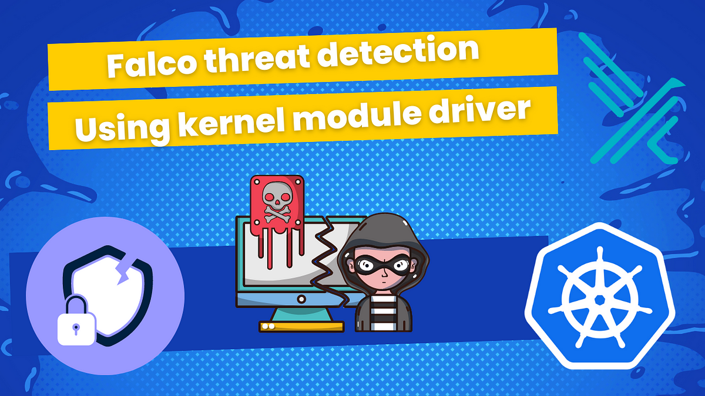

## Threat detection with Falco on EKS and using kernel module driver



[This tutorial on my blog](https://igorzhivilo.com/2024/05/12/falco-syscalls/)

In this tutorial, I will show how to:

This tutorial is continuation of previous one: [Threat detection with Falco and EKS Audit Logs](https://igorzhivilo.com/2024/05/06/falco-eks-audit-logs/)

In previous tutorial I used **Falco** plugin for **K8s Audit Logs**

And for this tutorial I will use **driver** called **Kernel Module**, in order to monitor system events from the kernel and trying to detect malicious behaviors on Linux systems.

It's important for me to say that I am focused on being practical as much as possible, like in other tutorials. Theory you can find plenty of on falco.org or with Google's help.


### Falco plugins

> "Plugins are used to extend Falco to support new data sources. The current plugin framework supports plugins with the following capabilities:

Plugin capabilities are composable, we can have a single plugin with both capabilities. Or on the other hand, we can load two different plugins each with its capability, one plugin as a source of events and another as an extractor. A good example of this is the Kubernetes Audit Events and the Falcosecurity Json plugins. By deploying them both we have support for the K8s Audit Logs in Falco

Note that the driver is not required when using plugins."

### Falco drivers
> "Falco needs a driver to analyze the system workload and pass security events to userspace. The supported drivers are:

* Kernel module

* eBPF probe

* Modern eBPF probe

The driver should be installed on the node where Falco is running. The kernel module (default option) and the eBPF probe are installed on the node through an init container (i.e. falco-driver-loader) that tries download a prebuilt driver or build it on-the-fly as a fallback. The Modern eBPF probe doesn't require an init container because it is shipped directly into the Falco binary. However, the Modern eBPF probe requires recent BPF features."

When using the drivers, Falco is deployed as a DaemonSet. By using a DaemonSet, Kubernetes ensures that a Falco instance will be running on each of our nodes even when we add new nodes to our cluster. So, it is the perfect match when we need to monitor all the nodes in our cluster.

### Prerequisites

* Existing EKS cluster


## Install Falco to your EKS cluster using helm chart

### values.yaml

```yaml
tty: true
kubernetes: false # disable the collection of k8s metadata

falco:
  rules_file:
    - /etc/falco/rules.d
  plugins:
  load_plugins: []

driver:
  enabled: true 
  loader:
    enabled: true
collectors:
  enabled: false #disable the collection of container metadata

falcoctl: #use falcoctl to install automatically the plugin and the rules
  indexes:
  - name: falcosecurity
    url: https://falcosecurity.github.io/falcoctl/index.yaml
  artifact:
    install:
      enabled: false
    follow:
      enabled: false
  config:
    artifact:
      allowedTypes:
        - plugin
        - rulesfile
      install:
        enabled: false
        resolveDeps: false
        refs: []
      follow:
        refs: []

tolerations: # Add tollerations for all taints you have on worker nodes
  - effect: NoSchedule
    key: on-demand-large-node
    operator: Exists
```

* Driver must be enabled.

* Proper tolerations must be added to the DaemonSet configuration to allow deployment to all worker nodes of your cluster.

#### Here are some common issues that you might face during the deployment of Falco:

* Need to properly add tolerations as I described above, otherwise Falco will not be deployed to all worker nodes and you can miss security events on those nodes.

* Docker hub rate limit: During DaemonSet deployment to all worker nodes, you may encounter Docker Hub rate limits because the Falco image must be pulled on each node. To solve this issue, you must be registered with Docker Hub and pay Docker Hub fees, or use an alternative source for images. I opted for the second option and used a public ECR image. Here's an example of a values.yaml file with the usage of ECR's Falco public images.

```yaml
falco:
  tty: true
  kubernetes: false #disable the collection of k8s metadata

  image:
    pullPolicy: IfNotPresent
    registry: public.ecr.aws
    repository: falcosecurity/falco-no-driver
    tag: ""

  falco:
    rules_file:
      - /etc/falco/rules.d
    plugins:
    load_plugins: []
  
  driver:
    enabled: true 
    loader:
      enabled: true
      initContainer:
        image:
          pullPolicy: IfNotPresent
          registry: public.ecr.aws
          repository: falcosecurity/falco-driver-loader
          tag: "0.37.1"
  collectors:
    enabled: false #disable the collection of container metadata
     
  falcoctl: #use falcoctl to install automatically the plugin and the rules
    image:
      pullPolicy: IfNotPresent
      registry: public.ecr.aws
      repository: falcosecurity/falcoctl
      tag: "0.7.3"
    indexes:
    - name: falcosecurity
      url: https://falcosecurity.github.io/falcoctl/index.yaml
    artifact:
      install:
        enabled: false
      follow:
        enabled: false
    config:
      artifact:
        allowedTypes:
          - plugin
          - rulesfile
        install:
          enabled: false
          resolveDeps: false
          refs: []
        follow:
          refs: []
```

* The DaemonSet wasn't fully deployed: a couple of pods were in a pending state and not running. This problem occurred for 5% of the pods. The reason for that was the full capacity of the nodes; the Kubernetes scheduler wasn't able to deploy Falco pods to those nodes due to insufficient 'CPU / memory' resources. To solve this problem, I used Pod Priority Class to give higher priority to those pods. Here's an example of how to use it with values.yaml:


podPriorityClassName: "system-cluster-critical"



```html
> Pod Priority and Preemption
https://kubernetes.io/docs/concepts/scheduling-eviction/pod-priority-preemption/
```


### Installation of Falco helm chart

```bash
# Add falcosecurity repo
helm repo add falcosecurity https://falcosecurity.github.io/charts
helm repo update

# Install falco from values.yaml to falco namespace
helm install falco falcosecurity/falco --namespace falco \
--create-namespace -f values.yaml
```


DaemonSet deployed succefully to all(11) worker nodes in my case.

## Send your notifications to slack

In order to send notifications to Slack, you need to add this section to your values.yaml.

```yaml
falcosidekick:
  enabled: true 
  webui:
    enabled: false
    redis:
      enabled: true
  config:
    slack:
      webhookurl: "https://hooks.slack.com/services/YOUR-WEBHOOK-ID"
```

But first, you need to create a channel in Slack for notifications, get the webhook ID of your channel, and replace 'YOUR-WEBHOOK-ID' with the correct one.

> Read here how to create channel and get webhook ID
https://api.slack.com/messaging/webhooks

## Overview of the most useful rules, in my opinion

You can find list of all rules [here](https://github.com/falcosecurity/falco/blob/e3dbae325935dd2ddec5edb750ee8dfda0b785d6/rules/falco_rules.yaml)

#### List of my favorites rules:

* Read sensitive file trusted after startup
* Read sensitive file untrusted
* Run shell untrusted
* Launch Privileged Container
* Launch Excessively Capable Container
* Terminal shell in container
* Contact EC2 Instance Metadata Service From Container
* Contact cloud metadata service from container
* Netcat Remote Code Execution in Container
* Launch Suspicious Network Tool in Container
* Launch Suspicious Network Tool on Host
* Search Private Keys or Passwords
* Set Setuid or Setgid bit
* Detect outbound connections to common miner pool ports
* Detect crypto miners using the Stratum protocol
* The docker client is executed in a container
* Container Run as Root User
* Sudo Potential Privilege Escalation
* Debugfs Launched in Privileged Container
* Polkit Local Privilege Escalation Vulnerability (CVE-2021–4034)
* Detect release_agent File Container Escapes
* Java Process Class File Download
* Modify Container Entrypoint

## Using custom rules

In order to use custom rules you need to add this section to values.yaml

```yaml
customRules:
    custom_rules.yaml: |-
      # Add Your rules hereHow to test you rule set?
```

You can read it also in my previous [post]({{site.baseurl}}/2024/05/06/falco-eks-audit-logs/)

## How to test you rule set?

Let's test 'Terminal shell in container' rule for example, for this you need to exec into any pod in your cluster:


kubectl exec -it any-pod -- /bin/sh



You will see notifications coming to a Slack channel you defined with a webhook ID (with a slight difference).

Thank you for reading, I hope you enjoyed it, see you in the next post.

The code of helm chart created you can find in my [repo](https://github.com/warolv/k8s-security)

Please subscribe to my [YT channel](https://www.youtube.com/@igorzhivilo) and [twitter](https://twitter.com/warolv), to be notified when the next tutorial is published.
