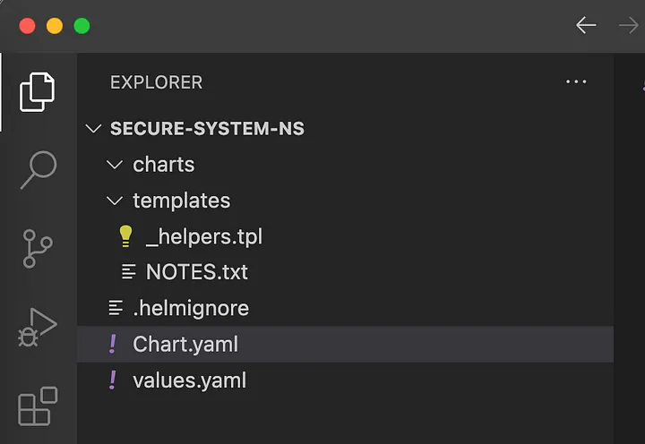

## Secure namespaces in Kubernetes cluster using RBAC


In this tutorial, I will show how to secure **'system‘** namespaces in EKS cluster by user access.

List of **namespaces** with **limited** access:

* kube-system
* monitoring

I will define them as **‘system’** namespaces, which are mostly infra related and contains workloads for monitoring (prometheus | grafana) , k8s system workloads such as addons of EKS and operators needed in order to support developer’s workloads.

Must be fully accessible by **‘devops’** users, and read only by **‘developer’** and **‘view’** users.

The rest of the namespaces contains workloads of **‘developer’** users and must be fully accessible by them.

List of **namespaces** with **full access** for developers:

* app1
* app2
* app3

### Users defined in EKS cluster

**DevOps**

* Full access to all resources in all namespaces.

**Developer**

* Full access to all ‘developer‘ namespaces.

* Read only access to ‘system’ namespaces.

**Viewer**

* Read only access to all namespaces

> "The reasoning behind separation of namespaces for user access, are incidents which might happen (happened in my case) like deletion of monitoring tools or different k8s operators needed to support application workloads."


### Let’s do it

For this tutorial I will create a simple helm chart to be deployed to k8s cluster.

chart name: secure-system-ns

Create helm chart

```bash
helm create secure-system-ns
```

Delete everything from ‘templates’, leave only ‘_helpers.tpl’ and NOTES.txt.



### Define RBAC for ‘developer’ group

> "For ‘devops’ user group and ‘view’ user group, built in k8s roles will be used, that why we need define RBAC only for developer group."

### Create ‘RoleBinding’ for ‘developer’ group

developer-rb.yaml must be added to templates folder.

```yaml
# Create role-binding with admin permissins for 'developer namespaces'
{{- range .Values.devNamespace }}
apiVersion: rbac.authorization.k8s.io/v1
kind: RoleBinding
metadata:
  name:  "{{ . }}-dev-admin-rb"
  namespace: {{ . }}
subjects:
- kind: Group
  name: developer
  apiGroup: rbac.authorization.k8s.io
roleRef:
  kind: ClusterRole
  name: admin
  apiGroup: rbac.authorization.k8s.io
---
{{- end }}
# Create role-binding with view permissins for 'system namespaces'
{{- range .Values.systemNamespace }}
apiVersion: rbac.authorization.k8s.io/v1
kind: RoleBinding
metadata:
  name:  "{{ . }}-dev-ro-rb"
  namespace: {{ . }}
subjects:
- kind: Group
  name: developer
  apiGroup: rbac.authorization.k8s.io
roleRef:
  kind: ClusterRole
  name: view
  apiGroup: rbac.authorization.k8s.io
```

values.yaml

```yaml
devNamespace:
  - app1          
  - app2
  - app3                   

systemNamespace:
  - kube-system     
  - monitoring      
```

### Explanation:

1. I am using builtin k8s cluster roles: **‘view’** and **‘admin’** which gives view or full access to resources on the namespace level accordingly.

> "On the namespace level because we using ‘RoleBinding’ with ‘ClusterRole’, and ‘RoleBinding’ creates binding on namespace level."

2. I defined in values.yaml, two **‘system’** namespaces: [ kube-system | monitoring ] and three **‘developer’** namespaces [ app1 | app1 | app1 ]

And because in developer-rb.yaml I am using ranges: ‘{{- range .Values.devNamespace }}’, the moment you install the helm chart to your cluster, it will create binding for each ‘developer’ namespace which looks like:

**for app1 namespace (‘developer’ namespace):**

```yaml
apiVersion: rbac.authorization.k8s.io/v1
kind: RoleBinding
metadata:
  name:  "app1-dev-admin-rb"
  namespace: app1
subjects:
- kind: Group
  name: developer
  apiGroup: rbac.authorization.k8s.io
roleRef:
  kind: ClusterRole
  name: admin
  apiGroup: rbac.authorization.k8s.io
```

**for app2 namespace (‘developer’ namespace):**

```yaml
apiVersion: rbac.authorization.k8s.io/v1
kind: RoleBinding
metadata:
  name:  "app2-dev-admin-rb"
  namespace: app2
subjects:
- kind: Group
  name: developer
  apiGroup: rbac.authorization.k8s.io
roleRef:
  kind: ClusterRole
  name: admin
  apiGroup: rbac.authorization.k8s.io
```

> "meaning developer user will have admin permissions in ‘developer’ namespaces"

**for kube-system namespace (‘system’ namespace):**

```yaml
apiVersion: rbac.authorization.k8s.io/v1
kind: RoleBinding
metadata:
  name:  "kube-system-dev-ro-rb"
  namespace: kube-system
subjects:
- kind: Group
  name: developer
  apiGroup: rbac.authorization.k8s.io
roleRef:
  kind: ClusterRole
  name: view
  apiGroup: rbac.authorization.k8s.io
```

> "meaning ‘developer’ user will have view permissions in ‘system’ namespaces"

### Now it’s time to install created helm chart to EKS cluster:

```bash
helm install secure-system-ns ./secure-system-ns
```

### Edit aws-auth ConfigMap for maping IAM users to appropriate group

* To map ‘devops-user1’ to admin group, I am using builtin ‘system:masters’ group.

* To map ‘dev-user1’ to developer group, I am using used developer group, and role binding for I created previously.

* To map ‘view-user1’ to view group, I am using builtin ‘view’ group.

** Let’s edit aws-auth config-map: **

```bash
kubectl edit cm aws-auth -n kube-system
```

```yaml
mapRoles: |
  - userarn: arn:aws:iam::573501234567:user/devops-user1
    username: devops-user1
    groups:
      - system:masters
  - userarn: arn:aws:iam::573501234567:user/dev-user1
    username: dev-user1
    groups:
      - developer
  - userarn: arn:aws:iam::573501234567:user/view-user1
    username: view-user1
    groups:
      - view
```

Of course you need to replace ‘userarn’ with real one, which you can find in AWS console -> IAM -> users.


** Configuration is applied now and everything must work! **
